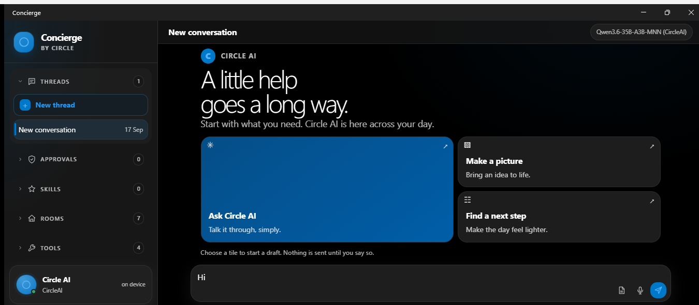

# Concierge for Windows: quick start

Concierge is a conversation workspace with Circle AI, tools, skills, and a persistent Creator canvas. Start with the workspace below, then use the sidebar to move between the things you do.

The left sidebar holds recent threads, approvals, active skills, destinations, and tools. The composer at the bottom is where you ask Circle AI for help. The controls under it set how much the assistant may do. The Circle AI card at bottom left opens Settings.

## Conversations

1. Select **New thread** to start fresh. Type in the composer and press **Send**.
2. Select a recent thread in **Threads** to continue it. Use **Show all** when it appears to reveal older threads.
3. Open **Tools → History** to find a thread by its title. Open a result to continue it. Select **Delete**, then confirm **Delete** or choose **Keep**.

## Assistant work and approvals

Send a request in the composer. Replies, plans, and tool activity appear in the conversation. A run keeps going if you switch threads; the sidebar marks a thread that is still working. Select **Approvals** to review requests that are waiting. Read the action and its reach, then choose **Allow** or **Deny**. You can also answer an approval where it appears in the conversation.

## Choose how much it can do

The composer offers three modes:

- **Plan only** — ask for a plan without carrying out tool actions.
- **Ask first** — the default; Concierge pauses for approval before actions that need it.
- **Act freely** — allow eligible actions without asking each time. Safety and risk rules still apply.

## Turn on a skill

Expand **Skills** in the sidebar and select **Browse all**. Search by skill name, area, or description, then select a result to turn it on for the conversation. Active skills appear in the sidebar and shape later replies. Select an active skill there to turn it off.

## Make something in Creator

Open **Tools → Creator**. Keep using the same composer: describe what you want and Circle AI directs the canvas. Choose **Page**, **Slides**, **Video**, **Space**, **Sound**, **Phone**, or **Board** and pick a look. The design saves on this device as it changes. Use the thumbnail strip to revisit a visual moment; the back and forward arrows move between moments. Reopening Creator restores the latest saved canvas.

## Diagrams and images

- **Tools → Diagrams:** enter diagram text under **Draw one** to see it render. Under **Bring one in**, choose Figma or Penpot, enter a file ID, and select **Fetch**. Import choices appear only when that integration is configured.
- **Tools → Images:** describe the picture and select **Draw it**. Image generation needs an image provider configured on this device; Concierge explains when one is unavailable.

## Settings and Circle AI

Select the Circle AI card at the bottom of the sidebar to open Settings. There you can manage provider keys, family and safety controls, and appearance.

On Windows, **Circle AI chooses the on-device model automatically** for the laptop. There is no manual chat model/provider picker. If Circle AI needs to download a model, it asks first. Provider keys are for the features and integrations that use them; adding a key does not change Circle AI's automatic chat selection.

## Windows app icon

The Windows app icon now uses the Circle ring that appears in the workspace brand:

